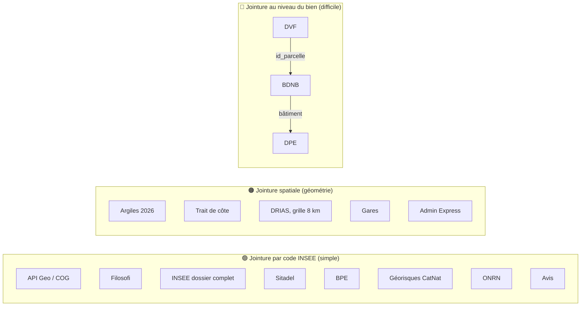
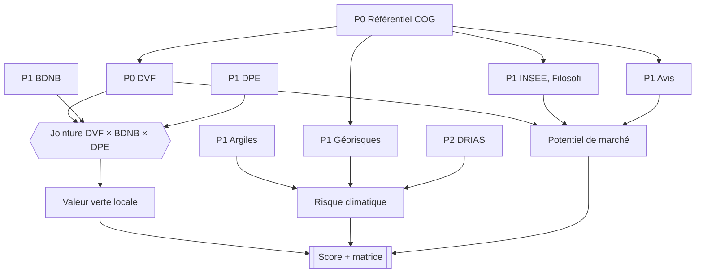

# Organiser et prioriser les sources

> Complément de [`02_sources.md`](02_sources.md), qui liste les sources. Ce document explique **comment** on les a organisées et **dans quel ordre** les collecter.
> Dernière vérification des pages sources : 17/09/2026.

---

## Étape 1 — Partir des questions, pas des données

**Le piège classique** : télécharger tout ce qui semble intéressant, puis chercher quoi en faire.
**La bonne méthode** est descendante :

```
question métier  →  indicateur  →  donnée nécessaire  →  source
```

Appliquée à notre problématique :

| Question | Indicateur | Donnée nécessaire | Source |
|---|---|---|---|
| Le marché est-il dynamique ? | Évolution du prix au m², ventes pour 1 000 logements | Ventes avec prix et surface ; nombre de logements | **DVF** ; **INSEE, dossier complet** |
| Les gens peuvent-ils acheter ? | Années de revenu pour un logement type | Revenu médian | **Filosofi** |
| La demande va-t-elle tenir ? | Évolution de la population, chômage, construction | Population, emploi, permis de construire | **INSEE** ; **Sitadel** |
| Le territoire est-il attractif ? | Équipements, gare, avis des habitants | Équipements, gares, texte | **BPE** ; **SNCF** ; **avis** |
| Le parc est-il énergivore ? | Part de logements F/G | Classe DPE par logement | **DPE ADEME** |
| Combien coûte une passoire à la vente ? | Décote G par rapport à D | **Vente + DPE du même bien** | **DVF × BDNB × DPE** |
| Le territoire est-il exposé aujourd'hui ? | CatNat, argiles, inondation, côte | Arrêtés, zones d'aléa | **Géorisques** ; **carte argiles 2026** ; **Cerema** ; **ONRN** |
| Et en 2040 ? | Jours > 35 °C, sécheresse, pluies extrêmes | Projections climatiques | **DRIAS (TRACC)** |
| Où sont les communes ? | Toutes les cartes et agrégations | Codes et contours | **API Geo / COG** ; **Admin Express** |

💡 **Pourquoi c'est important** : en soutenance, tu dois pouvoir justifier *chaque* source par une question. Une source qui ne répond à aucune question est du bruit, et elle coûte du temps d'ingestion et de nettoyage.

---

## Étape 2 — Qualifier chaque source

Pour chaque source, on se pose les **mêmes 8 questions**. C'est ce que font les data engineers en entreprise dans un *data catalog*.

| Critère | Question à se poser | Pourquoi ça compte |
|---|---|---|
| **Maille** | Une ligne correspond à quoi : une vente, un logement, une commune, un point de grille ? | Ça détermine comment on agrège et comment on joint. |
| **Clé de jointure** | Quel identifiant permet de la relier aux autres sources ? | Sans clé commune, pas de croisement possible. |
| **Couverture** | Quels territoires et quelles années ? Y a-t-il des trous ? | Un trou mal géré produit une carte fausse. |
| **Fraîcheur** | À quelle fréquence est-elle mise à jour ? | Ça conditionne la stratégie de rechargement. |
| **Volume** | Combien de lignes et de gigaoctets ? | Pandas suffit-il, ou faut-il Spark ? |
| **Accès** | Fichier, API, compte obligatoire, scraping ? | Ça détermine le type d'ingestion à écrire. |
| **Licence** | Quelles contraintes de réutilisation ? | Obligation légale. |
| **Qualité connue** | Données brutes, déclaratives, corrigées ? | Ça anticipe le travail de nettoyage. |

### Fiches qualifiées

| Source | Maille | Clé de jointure | Couverture et trous | MAJ | Volume | Accès | Licence et contraintes |
|---|---|---|---|---|---|---|---|
| **DVF géolocalisées** | Ligne de vente (un lot, une parcelle) | `code_commune`, `id_parcelle`, lat/lon | 5 ans glissants. ⚠️ **Pas de données pour l'Alsace-Moselle (57, 67, 68) ni pour Mayotte** | Semestrielle (avril, octobre) | Plusieurs millions de lignes par an *(à mesurer)* | Fichiers CSV.gz | Réutilisation libre, **mais interdiction de ré-identifier les personnes et d'exposer les données à l'indexation des moteurs de recherche** (CGU DGFiP) |
| **DPE logements existants** | Un DPE | Adresse / identifiant BAN *(à vérifier)*, code INSEE | Depuis juillet 2021 ; méthode modifiée le 01/01/2026 | Hebdomadaire | **≈ 15,6 millions** de DPE | API, export, dump PostgreSQL | Licence Ouverte v2.0. Données brutes saisies par les diagnostiqueurs, **non corrigées** |
| **BDNB** | Groupe de bâtiments | Parcelle, bâtiment, adresse | France entière ; millésime **2026-02.a** | Environ 2 fois par an | Lourd à l'échelle nationale : exports **par département** pour développer, **export France complète** pour l'exécution finale | Téléchargement libre, France ou département | Open data *(licence exacte à vérifier dans la documentation)* |
| **Géorisques (GASPAR)** | Arrêté / risque par commune | Code INSEE | France | Continue | Faible | API | Données publiques |
| **Argiles 2026** | Zone d'exposition (polygone) | Géométrie → **jointure spatiale** | Métropole ; carte en vigueur au 01/07/2026 | Ponctuelle | Moyen | Fichier SIG | Données publiques |
| **DRIAS (TRACC)** | Point de grille de 8 km | Coordonnées → **rattachement spatial** | France ; par niveau de réchauffement | Ponctuelle | Moyen | **Compte gratuit requis** | Conditions Météo-France *(à lire)* |
| **Filosofi 2021** | Commune | Code INSEE | ⚠️ **Valeurs absentes pour les petites communes (secret statistique)** | Annuelle, avec 2-3 ans de décalage | Faible | Fichier | Données INSEE |
| **API Geo / COG** | Commune, département, région | Code INSEE | France | Annuelle (le 1er janvier) | Faible (~35 000 communes) | API JSON | Données publiques |
| **Avis d'habitants** | Un avis | Commune (via l'URL) | ⚠️ **Peu ou pas d'avis dans les petites communes** | Continue | Moyen | **Scraping** | Conditions du site ; usage académique, collecte polie |

**À toi de compléter** les sources P2 et P3 (voir plus bas) avec la même grille.

💡 **Deux enseignements à retenir**

1. **L'Alsace-Moselle est absente de DVF.** Sur la carte, ces départements doivent apparaître « données non disponibles » (en gris), **jamais à 0**. C'est une question typique de jury.
2. **Les CGU de DVF interdisent l'indexation par les moteurs de recherche.** Si tu déploies l'app en ligne (bonus), il faut une authentification ou au minimum une balise `noindex`, et aucune vente individuelle rattachable à une personne ne doit être affichée.

---

## Étape 3 — Les 3 types de jointure du projet

Classer les sources par **type de clé** montre où se trouve la difficulté technique :



| Type | Difficulté | Outil | Exercice |
|---|---|---|---|
| 🟢 Code INSEE | Faible, à condition de normaliser les codes (zéros initiaux, Corse, arrondissements) | Spark / SQL | E2 |
| 🟠 Spatiale | Moyenne : systèmes de coordonnées, validité des géométries | PostGIS (`ST_Intersects`, `ST_Contains`) | E4 |
| 🔴 Au niveau du bien | Élevée : parcelles, copropriétés, dates | Spark (grosses jointures) | **E3, cœur du projet** |

---

## Étape 4 — Prioriser

**Règle** : priorité = **valeur pour la problématique** × **faisabilité**, en respectant les **dépendances** (on ne peut pas calculer une décote DPE sans DVF, DPE et BDNB).

| Priorité | Sens | Sources |
|---|---|---|
| **P0 — Socle** | Sans elles, rien ne marche | API Geo / COG · Admin Express (contours) · **DVF** |
| **P1 — Cœur de la problématique** (MVP) | Répondent directement à « potentiel × risque 2040 » | **DPE ADEME** · **BDNB** · **Géorisques CatNat** · **Argiles 2026** · INSEE dossier complet · Filosofi · **Avis d'habitants** (source textuelle **exigée par le sujet**) |
| **P2 — Enrichissement** | Rendent l'analyse plus solide | DRIAS (TRACC) · ONRN sinistralité · Trait de côte · Sitadel · BPE · Gares SNCF · Historique des populations |
| **P3 — Optionnel** | Seulement si le temps le permet | BAN (plan B de jointure) · SIRENE · Annonces de vente · Carte des loyers · Délinquance |

**Bilan** : P0 + P1 = 10 sources, et **P0 + P1 + P2 = 17 sources**. Le minimum de 12 exigé par le sujet est donc atteint avec les P2.

### Graphe des dépendances



---

## Étape 5 — Plan de collecte en vagues

| Vague | Sources | Objectif de fin de vague |
|---|---|---|
| **Vague 1** | API Geo, Admin Express, DVF | Carte des prix au m² par commune : d'abord sur l'échantillon, puis **France entière** |
| **Vague 2** | DPE, BDNB, Géorisques, Argiles | Taux de correspondance DVF × DPE mesuré ; carte de la part de passoires |
| **Vague 3** | INSEE, Filosofi, avis | Premiers indicateurs de potentiel ; première analyse de sentiment |
| **Vague 4** | DRIAS, ONRN, trait de côte, Sitadel, BPE, gares | Les 17 sources en place, **pipeline exécuté sur la France entière** |

### Périmètre : la France entière, avec un échantillon pour développer

🎯 **La cible est la France entière** : environ 35 000 communes, 101 départements et 18 régions. L'échantillon ci-dessous sert **uniquement pendant le développement**.

**Pourquoi développer sur un échantillon ?** C'est la pratique standard en data engineering :

| | Développement | Exécution finale |
|---|---|---|
| Données | 4 départements contrastés | **France entière** |
| Durée d'un job | Quelques minutes | De dizaines de minutes à quelques heures |
| Objectif | Écrire, tester, corriger vite | Produire les résultats de l'app |
| Réglage | `DEV_DEPARTEMENTS=33,13,69,23` | `DEV_DEPARTEMENTS=` (vide) |

Si le code tourne correctement sur 4 départements très différents, il y a de bonnes chances qu'il tourne sur 101. Le passage à l'échelle nationale reste une étape à part entière : c'est là que le cluster Spark devient **indispensable**.

| Dépt (échantillon) | Pourquoi |
|---|---|
| **33 Gironde** | Marché dynamique (Bordeaux), littoral en recul, argiles |
| **13 Bouches-du-Rhône** | Chaleur, sécheresse, inondations, grand marché urbain |
| **69 Rhône** | Métropole, appartements, arrondissements de Lyon (test des codes PLM) |
| **23 Creuse** | Rural, prix bas, parc ancien avec beaucoup de passoires |

On évite les départements 57, 67 et 68 dans l'échantillon, car ils sont absents de DVF. **Dans l'exécution nationale, ils restent sur la carte en « données non disponibles »** pour la partie prix. Leurs autres indicateurs (DPE, risques, INSEE) restent affichés.

### Téléchargements nationaux

| Source | Version nationale |
|---|---|
| DVF | Fichiers `full.csv.gz` par année (France entière) |
| DPE ADEME | Export ou dump complet (≈ 15,6 millions de lignes) |
| BDNB | Export **France complète** sur data.gouv (plutôt que les exports départementaux) |
| BAN | Fichier national |
| Géorisques | API interrogée pour chacune des ~35 000 communes : **prévoir la gestion des limites de débit et la reprise sur erreur** |
| Autres | Fichiers déjà nationaux |

### Conséquence sur l'infrastructure

À l'échelle nationale, les volumes (DVF sur 5 ans, 15,6 millions de DPE, BDNB France) dépassent ce qu'un ordinateur portable traite confortablement avec 2 workers à 2 Go. Plusieurs options, à valider avec ton pédago :
- **Databricks Free Edition** ou les **VM du campus** pour l'exécution nationale ;
- en local : augmenter `SPARK_WORKER_MEMORY`, ne garder que les colonnes utiles dès le bronze → silver, et traiter les données **département par département en boucle**.

💡 Mesure les temps de chaque job sur l'échantillon, puis sur la France entière, et note-les dans ton journal. C'est l'argument le plus concret en soutenance pour justifier Spark et le cluster.

---|---|
| **33 Gironde** | Marché dynamique (Bordeaux), littoral en recul, argiles |
| **13 Bouches-du-Rhône** | Chaleur, sécheresse, inondations, grand marché urbain |
| **69 Rhône** | Métropole, appartements, arrondissements de Lyon (test des codes PLM) |
| **23 Creuse** | Rural, prix bas, parc ancien avec beaucoup de passoires |

➡️ À mettre dans ton `.env` : `DEV_DEPARTEMENTS=33,13,69,23`. On évite les départements 57, 67 et 68, absents de DVF.

---

## ✅ À toi de jouer

1. **Vérifie** chaque page P0 et P1 :
   - recopie l'URL de téléchargement réelle dans `config/sources.yaml` ;
   - note la date de dernière mise à jour ;
   - complète les cellules *(à vérifier)* et *(à mesurer)* des fiches ci-dessus.
2. **Qualifie** les sources P2 avec la grille des 8 critères, en ajoutant des lignes au tableau des fiches.
3. **Petit exercice de code (échauffement E1)** : `config/sources.yaml` contient maintenant un champ `priorite`. Modifie `download.py --list` pour trier les sources par priorité et ajouter une option `--priorite P0`.
4. **Questions pour vérifier ta compréhension**
   - Pourquoi la jointure DVF × DPE est-elle beaucoup plus difficile qu'une jointure par code INSEE ?
   - Que se passe-t-il sur ta carte si tu oublies que l'Alsace-Moselle est absente de DVF ?
   - Pourquoi DRIAS demande-t-il une jointure spatiale alors que Filosofi non ?
   - Pourquoi la source textuelle est-elle en P1 alors qu'elle pèse peu dans le score ?

Réponds-moi (même approximativement) et on corrige ensemble avant de passer à la vague 1.
