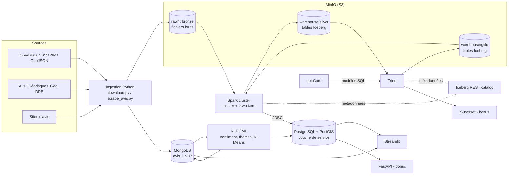
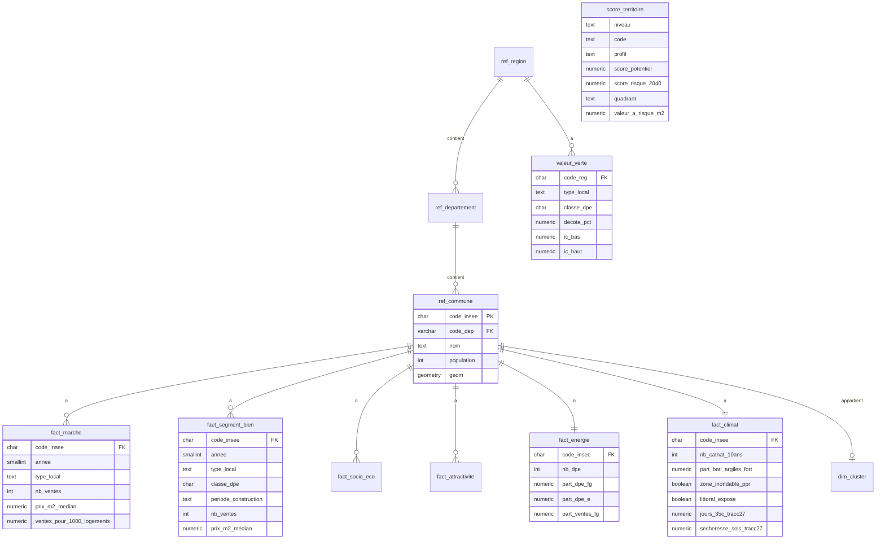

# Architecture technique

> La stack détaillée, avec les équivalents AWS, se trouve dans [`00_stack.md`](00_stack.md).

## Vue d'ensemble



### Rôle de chaque couche

| Couche | Emplacement | Écrit par | Contenu |
|---|---|---|---|
| **Bronze** | `s3://raw/<source>/<date>/` | Ingestion Python | Fichiers originaux + `_manifest.json` (URL, date, hash) |
| **Silver** | `iceberg.silver.*` | Spark | Données typées, dédoublonnées, filtrées, rattachées au COG |
| **Gold** | `iceberg.gold.*` | dbt via Trino | Indicateurs multi-niveaux, score d'opportunité |
| **Service** | PostgreSQL `public.*` | Spark (JDBC) | Copie indexée des tables gold et des géométries, pour l'app |
| **Texte** | MongoDB `homepedia.*` | Scraper + NLP | Avis, sentiment, thèmes |

## Pourquoi PostgreSQL en plus d'Iceberg ?

- **Exigence du sujet** : une base relationnelle *et* une base non relationnelle, avec indexation et optimisation.
- **Latence** : Trino est conçu pour les requêtes analytiques, pas pour des dizaines de petites requêtes interactives. Une copie indexée dans PostgreSQL rend l'app fluide.
- **Géographie** : PostGIS gère les contours, la simplification des géométries et les requêtes « communes à moins de 20 km ».

## Schéma relationnel cible (PostgreSQL)

> Ce schéma reflète la problématique **achat/vente × risque climatique × DPE**.
> Le fichier `db/postgres/init/01_schema.sql` date de la première version (loyers, concurrence). **L'adapter à ce schéma est l'exercice E4** du [parcours d'apprentissage](06_parcours_apprentissage.md).



- **`fact_segment_bien`** répond à « quels biens » : prix par type × classe DPE × période de construction.
- **`valeur_verte`** stocke les sorties du modèle hédonique (voir `05_ia.md`).
- **`score_territoire`** remplace `score_opportunite` : 2 axes (potentiel / risque), un quadrant et la valeur à risque.

### Optimisations
- **Côté lakehouse** :
  - tables Iceberg partitionnées, par exemple `silver.dvf_mutations` par `annee` et `code_departement` ;
  - compaction régulière avec `rewrite_data_files` ;
  - tri `ORDER BY code_insee` pour améliorer le *data skipping*.
- **Côté PostgreSQL** :
  - index B-tree composites `(code_insee, annee)` ;
  - index GIST sur les géométries ;
  - vues matérialisées par niveau ;
  - table `indicateur_territoire` en format long, pour afficher n'importe quel indicateur sans modifier le code ;
  - géométries simplifiées pour l'affichage.
- **Côté MongoDB** : index sur `code_insee` et `nlp.sentiment`, et index **texte** en langue française.

## Modèle documentaire (MongoDB)

```js
// avis
{ _id, code_insee: "69123", source: "ville-ideale", url, date_avis, date_collecte,
  notes: { environnement: 7, transports: 8, securite: 5 },
  texte: "Quartier vivant mais bruyant le soir...",
  nlp: { sentiment: "positif", score: 0.81, themes: ["transports", "bruit"], mots_cles: ["bruit"] } }

// nlp_synthese_commune
{ code_insee, nb_avis, sentiment_moyen, repartition: { positif, neutre, negatif },
  top_themes: [...], mentions: { bruit: 12, insecurite: 3 } }

// raw_api : réponses JSON brutes (Géorisques…)
```

## Services Docker

| Service | Image | Port(s) | Profil |
|---|---|---|---|
| minio | `cgr.dev/chainguard/minio` | 9000 (S3), 9001 (console) | cœur |
| iceberg-rest | `apache/iceberg-rest-fixture` | 8181 | cœur |
| spark-master | `docker/spark` (basé sur `apache/spark:3.5.9-java17-python3`) | 8080 (UI), 7077 | cœur |
| spark-worker-1/2 | idem | 8081, 8082 | cœur |
| trino | `trinodb/trino` | 8085 | cœur |
| postgres | `postgis/postgis:16-3.4` | 5432 | cœur |
| mongo | `mongo:7` | 27017 | cœur |
| app (Streamlit) | `docker/python` | 8501 | cœur |
| tools (ingestion, dbt, NLP) | `docker/python` | — | cœur (lancé à la demande) |
| superset | `docker/superset` | 8088 | `bi` |
| api (FastAPI) | `docker/python` | 8000 | `api` |

Les jobs Spark sont soumis depuis `spark-master`, qui sert de driver : la version de Python est ainsi la même sur le driver et sur les workers.
Le code ne dépend que des variables d'environnement (`S3_ENDPOINT`, `ICEBERG_URI`…). Il est donc portable vers Databricks ou EMR.
